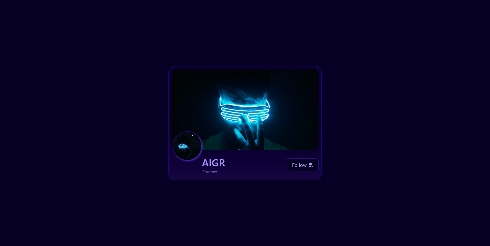

# 👤 Add / Remove Feature — Interactive Profile UI

An interactive **Add / Remove (Follow–Unfollow) feature** built using **HTML**, **SCSS**, and **JavaScript**. This project simulates a **social-media–style profile interaction**, focusing on **state toggling**, **DOM manipulation**, and **UI feedback**.

The UI dynamically updates the relationship status and button appearance based on user interaction, delivering a clean and realistic micro-interaction experience.

---

## ✨ Features

- ➕ **Follow user Interaction**
- ➖ **Unfollow user Interaction**
- 🔁 **Toggle relationship state** (Stranger ↔ Following)
- 🧠 **State-based logic** using JavaScript
- 🎨 **Dynamic UI updates** (text, icons, colors, styles)
- 🧩 **Pure HTML, SCSS & JavaScript**
- ⚡ Smooth hover and interaction feedback
- 📱 Responsive and modern card layout

---

## 🌐 Live Demo / Review

You can view and interact with the project here:  
👉 [Add / Remove Feature - Live Demo](https://harsh-codes-hub.github.io/Add-Remove-Feature-TASK14/)

Click the button to toggle between **Follow** and **Unfollow** states.

---

## 🗂️ File Structure

```bash
Add-Remove-Feature-TASK14/
│
├── index.html        # Main HTML structure
├── style.css         # Compiled CSS from SCSS
├── style.scss        # SCSS source file
├── script.js         # JavaScript logic
├── preview.webp      # Preview image
│
├── /favicon          # Website icons & manifest
│   ├── android-chrome-192x192.png
│   ├── android-chrome-512x512.png
│   ├── apple-touch-icon.png
│   ├── favicon-16x16.png
│   ├── favicon-32x32.png
│   ├── favicon.ico
│   └── site.webmanifest
│
└── README.md         # Project documentation

```

---

## 💻 Usage

1. **Clone the repository:**
   ```bash
   git clone https://github.com/Harsh-Codes-hub/Add-Remove-Feature-TASK14.git
   ```
2. **Navigate to the project directory:**
   ```bash
   cd Add-Remove-Feature-TASK14
   ```
3. _Open the project in your browser_
   ```
   open index.html
   ```
   or simply double-click on **index.html**

---

## 🧠 Learning Highlights

- 👤 Implemented **follow / unfollow logic** using **JavaScript**
- 🔁 Practiced **state toggling** with conditional logic
- 🖱️ Worked with **DOM selection and event listeners**
- 🎨 Dynamically updated **UI classes, text, and icons**
- 🧩 Strengthened understanding of **interactive UI patterns**
- ⚡ Built a realistic micro-interaction without libraries

---

## 🧠 What Makes This Project Special

- 👤 Real-world **social media–style interaction**
- 🔁 Clean and understandable **toggle logic**
- 🎨 Strong UI feedback for user actions
- 🧠 Beginner-friendly but production-relevant concept
- ⚡ Lightweight and framework-free
- 🧩 Great foundation for larger JS-driven components

---

## 📸 Preview

_Profile card showcasing follow/unfollow state transitions._



---

## 🛠️ Built With

- 🧾 **HTML5**
- 🎨 **CSS3 / SCSS**
- 🧩 **JavaScript (DOM & Events)**
- 🎯 **Interactive UI Design**
- 📱 **Responsive Layout**

---

## 👨‍💻 Author

**Cohort 2.0 – Batch Task 14 Submission**  
Created by **Harsh Gajrani** _(Harsh Codes Hub)_  
Part of the **Cohort 2.0 batch at Sheryians Coding School**

Part of frontend layout and design practice
Focused on **state handling, DOM manipulation, and UI feedback**

---

_⭐ If you’re learning JavaScript interactions or UI state management, this project is a great hands-on example — feel free to star the repository!_

---
